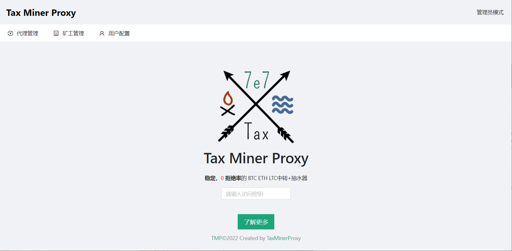
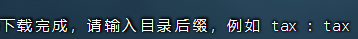

# Tax miner proxy

### 稳定，0拒绝率的 BTC ETH LTC Ton 全币种中转+抽水器



## 更新日志

```
2022-05-3     	    2.0.0>>>
			1. 更新了抽水算法，通过gpu_pool_mode和asic_pool_mode来控制平滑抽水，抽水机不再心电图
			2. 新增了拒绝率优化功能，使btc等专业机抽水时拒绝率进一步优化，提高收益
			3. 新增了内置于币印盒子的内置抽水的特殊版本
			4. 新增了自定义证书配置，支持凤凰内核的ssl连接
			5. 本地端更名为local.connector，去除tax等抽水标识
			6. 优化了多人抽水逻辑，使其更加合理
			7. 支持了DCR,ZEC的抽水
			8. 重新开放了web端
2022-03-2     	    1.1.9>>>
			1. 更新了本地隧道加密，配合本地端使用实现https混淆加密
2022-03-2     	    1.1.7>>>
			1. 新增了对Ton双挖的转发和抽水支持
			2. 新增了多人抽水功能
			3. 新增一键安装启动脚本
2022-02-25 	    1.1.6>>>
			1. web会影响BTC的功能，暂时下线
			2. 新增了linux和arm64的一键启动脚本，修复了一些系统中无法install的问题
			3. 新增了arm64的版本，供部分爱好者开发加密盒子
2022-02-14          1.1.0>>>
                    	1. 新增网页端，在网页端查看配置和在线机器
		    	2. 增加观察者模式和管理员模式，观察者仅可以看到机器在线，管理员可以看到抽水/在线
		    	3. 修复了一个内存泄露问题，一个连接数统计问题
2022-01-30    	    1.0.0>>>
                    	1. 增加了BTC和LTC专业矿机的抽水功能
                    	2. 重构了抽水逻辑，更加平滑，提供收益优先或平滑优先的选项
                    	3. 修复了使用轻松矿工时潜在的崩溃bug
                    	4. 新增了预设矿池的一键启动批处理
2022-01-17 	    0.0.4>>>
                    	1. 增加了config文件，支持config启动，和命令行启动两种模式，降低了使用难度
                    	2. 增加了开机自启功能，使用install命令配合config命令使用
                    	3. 增加了钱包统一抽水功能，使用devfee_woker参数
                    	4. 增加了enable_performance_mode参数，可以开启解除最大进程数和文件数限制
                    	5. 优化了代码逻辑，使得延迟降低
2022-01-13  	    0.2.3beta>>>
                    	1. 新增了ETC,RVN,ERG,CFX的转发和抽水功能
                    	2. 更新了网页配置器适配新版本的参数配置
                   	3. 修复了之前版本在某些特殊时刻少抽漏抽的问题
```

# 项目介绍

## 支持币种（2.0版本更新）:

**专业机：BTC / ETH / LTC / ETC / ScPrime / BCH / DCR / ZEC**

**显卡机：ETH / ETC / RVN / ERG / CFX / Ton**

本项目可嵌入币印盒子使用

本项目仅供学习交流，实验测试原理使用。

# 后续更新

- [x] 优化原本心电图式抽法为平稳抽法，同时进一步下降拒绝率，提高收益
- [x] 推出本地嵌入盒子使用的版本
- [x] 支持矿机端和服务器端隧道加密，防止SSL转发被查问题
- [ ] 支持web端启动和统一后台启动

# 使用方法

## Liunx一键管理工具 包含安装/启动/停止/删除/更新

**一键脚本视频教程  [https://www.youtube.com/watch?v=_anWdQ0Qn7c](https://www.youtube.com/watch?v=_anWdQ0Qn7c)**

**执行命令生成 管理控制脚本**

```
bash <(curl -s -L https://raw.githubusercontent.com/tax0x7e7/tax_miner_proxy/master/gen.sh)
```

**反复执行上面的命令，输入不同路径，可以生成多个不同的管理脚本，控制多个矿池链接：**



**根据提示启动管理控制脚本，不同名字的管理脚本控制不同矿池链接：**

**管理控制脚本：**

```bash
/root/tax-miner-proxy-tax-linux.sh
```

安装后，**修改config.yaml文件，改成你需要的矿池和钱包**，再通过管理脚本来启动服务。

**查看后台运行情况:**

```
tail -f /tmp/tax_proxy--端口.stat.log
```

## 手动安装

**Windows直接网页下载项目，Linux或ubuntu系统下载项目：**

```
git clone https://github.com/tax0x7e7/tax_miner_proxy.git
cd tax_miner_proxy/linux
```

**修改config.yaml文件**

```bash
# 代币类型，目前支持：eth/etc/rvn/erg/cfx/btc/ltc/scp/ltc
coin_type: "eth"
# 程序本地转发端口
local_addr: ":9998"
# 是否启用客户端 SSL 加密, 如果内核里边使用 SSL 连接的话，需要设置这个选项为 true
enable_client_ssl: true
# 远程代理地址，常用地址（E池/鱼池/币印等）已经内置 SSL/TCP 判断
remote_addr: "asia2.ethermine.org:5555"
# 是否启用服务端 SSL 加密
# 大部分常用矿池已经自动进行了判断，无需特殊设置，若设置为 true，则优先级最高
enable_server_ssl: false
# 抽水比例(支持小数)，最高 100，默认值 0，不抽水
devfee_rate: 1.3
# 抽水钱包，请务必自行确认其有效性
wallet: "0xxxxxxxxxxxxxxxxxxxxxxxxxxxxxxxxxxxxxx"
# 多人抽水能力支持，当存在 wallets 时候，会覆盖 wallet 参数
# shares 仅支持整数，且所有 shares 的和应为 (0,10]，超出范围会直接终止程序运行（注意前开后闭）
# shares 为 0 意味暂时不为该地址就行 shares 分配，请知悉
# 例: shares 1:1 意味着两个地址，每两波抽水，每个人拿走一波，跟抽水比例无关，2:1 则A拿走两波，B一波
# 单人抽水的话，可以直接删除wallets参数，也可以只填一个content，删除多余的content
# 支持最多10个人分成，复制多对 content-shares 添加在下面即可
wallets:
  - content: "0xxxxxxxxx001"
    shares: 1
  - content: "0xxxxxxxxx002"
    shares: 1    
# 抽水矿池地址，默认使用转发矿池地址
devfee_addr: ""
# 是否启用抽水 SSL 加密, 大部分常用矿池已经自动进行了判断，无需特殊设置，若设置 true，则优先级最高
enable_devfee_ssl: false
# 抽水时候指定的统一 worker 名称
devfee_worker: ""
# web端本地地址, 格式同 local_addr
dashboard_addr: ""
# 管理员 token
dashboard_admin_token: "tax-yyds"
# 观察者 token
dashboard_observer_token: "tax-yyds"
```

启动：

```
./tax.miner.proxy -conf config.yaml
```

**2.0版本新增参数**

```bash
#######################
#   新增功能配置区  #
######################
# 加密模式
# 0: 不启用加密，2：服务端（接收加密数据），发送加密数据请使用本地解密端
encrypt_mode: 0

# 显卡机（RTX3080） 矿场抽水模式开关
# 推荐大客户使用，抽水更加平稳且不会心电图
# 但是机器之间抽水份额会不平均，存在随机性
# 会增加一定随机性，每次掉线 10% ～ 30% 左右的机器
gpu_pool_mode: false

# 专业机（蚂蚁，芯动，阿瓦隆） 矿场抽水模式开关
# 推荐大客户使用，抽水更加平稳且不会心电图
# 但是机器之间抽水份额可能会不平均，存在随机性
asic_pool_mode: false

# 仅当 asic_pool_mode 为 true 时候生效
# 抽水平滑级别，默认为 2
# level 1： 每次抽 50% ~ 100% worker
# level 2： 每次抽 25% ~ 50% worker
# level 3: 每次抽 10% ~ 25% worker
smooth_level: 2

# 实验性功能：任务难度检查 v2，有效降低低难度提交造成的拒绝率
#  开启后如发现算力波动明显，建议关闭此项后再进行观察
enable_reject_checker_v2: true

#######################
#   自定义域名证书配置区 #
######################
# 为凤凰内核使用ssl时准备的，不需要就不用管
# 当且仅当下面两项都不为空，自定义域名证书配置才会生效
# 自行签发域名证书推荐使用： https://github:com/acmesh-official/acme.sh

# 自定义域名证书路径，请使用绝对地址
# 例如 C:/User/tmp/certs/server.pem
domain_cert: ""

# 自定义域名证书私钥路径，请使用绝对地址
# 例如 C:/User/tmp/certs/private.key
domain_private_key: ""
```

#### 后台启动、进程守护、开机自启使用请看：[详细文档](start.md)

## 本地加密端使用方式 视频教程[https://youtu.be/eY0PL97-20Y](https://youtu.be/eY0PL97-20Y)

**使用本地端加密时候，服务器启动的config中，加密模式选 “2”**

```bash
# 加密模式
# 0: 不启用加密，1：客户端（发送加密数据）2：服务端（接收加密数据）
encrypt_mode: 2
```

**前台启动**

```
local.connector -l :本地端口 -r 服务器ip:服务器端口
```

**进程守护+开机自启**

```
local.connector -l :本地端口 -r 服务器ip:服务器端口 -install
local.connector -l :本地端口 -r 服务器ip:服务器端口 -start
```

**对于Hive系统，可以使用以下命令，会安装为开机自启**

```
bash <(curl -s https://raw.githubusercontent.com/tax0x7e7/tax_miner_proxy/master/connector.sh) :本地端口 -r 服务器ip:服务器端口
```

**注意：使用隧道混淆模式在纯转发时，会有0.1%的抽水，如果仅仅使用ssl来纯转发则不会有**

# 开发费用

开发费用从0.25%起 (当抽水比例不为0时) 随着抽水比例的提高线性上浮，在抽10%时开发费用0.75%, 同时支持满抽100，满抽时候开发会抽10%，纯转发功能时不抽水。请大家善良使用。

# 交流

QQ群：


