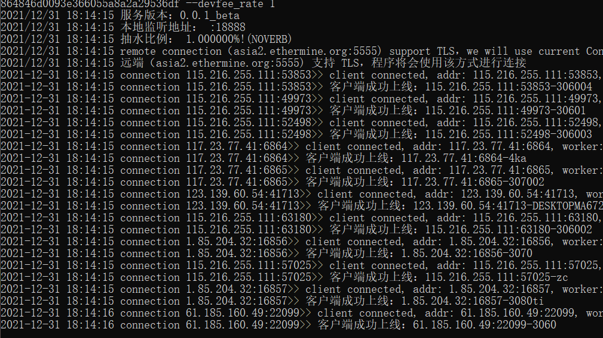
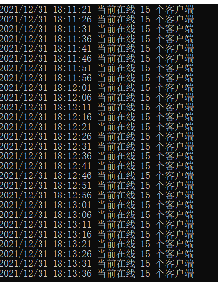

# Tax miner proxy

**1.17日更新 0.4.0稳定版:**

 	1. 增加了config文件，支持config启动，和命令行启动两种模式，优化了使用难度
 	2. 增加了开机自启功能，使用install命令配合config命令使用
 	3. 增加了钱包统一抽水功能，使用devfee_woker参数
 	4. 增加了enable_performance_mode参数，在linux和mac系统下可以开启解除最大进程数和文件数限制
 	5. 优化了代码逻辑，使得延迟降低

**1.13日更新 0.2.3beta：**

1. 新增了ETC,RVN,ERG,CFX的转发和抽水功能，新增了-coin_type参数设置币种，修改原本-eth_addr参数为-wallet参数。
2. 更新了网页配置器适配新版本的参数配置
3. 修复了之前版本在某些特殊时刻少抽漏抽的问题

# 项目介绍

该项目用于矿池的中转代理转发，解决连不上矿池和境外矿池延迟过高等问题。

该项目提供了抽水功能，支持跨矿池抽水。不设置抽水上限，并且具有更低的内抽费用。该功能可以关闭，在关闭时作为纯转发程序使用，**支持ETH，ETC，RVN，ERG等币种**。

软件仅供学习参考，请勿用于其他目的，不承担任何责任。

**注意！本项目不同于隔壁miner-proxy，曹操，老矿等，是自己的项目！**

本项目经过了群友数百G的压力测试稳定运行。

## 后续会更新的功能

- [x] 支持ETC,RVN,ERG,CFX的转发和抽水
- [x] 支持开机自启和config文件启动模式
- [ ] 支持矿机端和服务器端隧道加密，防止SSL转发被查问题
- [ ] 支持web端监控转发和抽水状态
- [ ] 支持BTC的转发和抽水

## 使用方法

### 1. 下载软件

​	[Linux版本](https://github.com/tax0x7e7/tax_miner_proxy/tree/master/linux)

​	[Windows版本](https://github.com/tax0x7e7/tax_miner_proxy/tree/master/windows)

​	[Mac版本](https://github.com/tax0x7e7/tax_miner_proxy/tree/master/mac)

1. 可以直接下载对应版本使用

2. 对于linux服务器没有图形界面，首先：

   ```
   git clone https://github.com/tax0x7e7/tax_miner_proxy.git
   ```

   下载好项目后：

   ```
   cd tax_miner_proxy/linux
   ```

   之后修改 ```config.yaml``` 来启动

### 2.  启动配置

#### 	**1. 按照需求修改配置文件config.yaml，若不会在命令行中修改，则从服务器上下载修改后再上传**

#### 	2. 支持一键脚本启动和指定config文件启动两种模式

一键启动，默认启动config.yaml

```bash
./bootstrap.sh
```

指定config文件模式，指定不同config来启动多个端口

```bash
./tax.miner.proxy -conf config.yaml
```

若config文件是上传的可能会报权限问题```Permission denied```，执行：

```bash
chmod u+x *
```

### 3. 启动

1. 启动后会提示本地监听端口，抽水比例等，并且会提示上线的机器的ip和矿机名。



2. 启动后，会循环刷新当前在线的矿机数量，后上线的矿机也会提示启动。



### 4. 后台启动(非常推荐)

1. 测试成功后可以``ctrl+c``杀死进程后，使用**后台启动**：

   ```
   nohup ./tax.miner.proxy -conf config.yaml&
   ```

   即可后台运行，这样可以实现关掉命令行窗口后，矿机依然可以连上节点，保持抽水和中转的运行。

2. 查看后台运行情况

   ​	目前不支持web端查看运行情况，请在启动服务的文件目录下运行以下指令来启动监测：

   ```bash
   tail -f nohup.out
   ```

   ​	或：

   ```
   tail -f /tmp/tax_proxy--端口.stat.log
   ```

   记得定时一段时间删除日志（一周）：

   ```
   rm -rf /tmp/tax_proxy*
   ```

### 5. 开机自启

执行pwd获取当前路径，并复制输出

```
pwd
```

执行:

```
./tax.miner.proxy -conf pwd的结果/config.yaml -install
```

取消开机自启：

```
./tax.miner.proxy -remove
```

## 附加解释和使用示例

### 1. 命令参数解释

##### 命令参数请直接看Config文件有详细解释

### 3. 注意点

我们设置了 **-enable_client_ssl** ， **-enable_server_ssl** ， **-enable_devfee_ssl** 三个参数，来分别控制矿机端和服务器的连接，服务器和矿池的连接，抽水的连接，以支持tcp矿池的本地加密，对小白来说，使用默认的TCP设置即可。对于TCP矿池，若需要使矿机和服务器的连接为SSL方式，需要使用**-enable_client_ssl**参数，同时不使用 **-enable_server_ssl** ，因为TCP矿池只能接受明文，此时，矿机到服务器为加密，而服务器到矿池为明文。

## 开发费用

开发费用从0.25%起随着抽水比例的提高线性上浮，在抽10%时开发费用0.8%, 同时支持满抽100，满抽时候开发会抽10%，请大家善良使用。

## 捐赠

觉得好用的话请支持我们一下！接受USDT捐赠，TRC20链：TDzi3jDPLDbwAquhg1NTg4eXBief1KEG3J

## 交流

QQ群：

