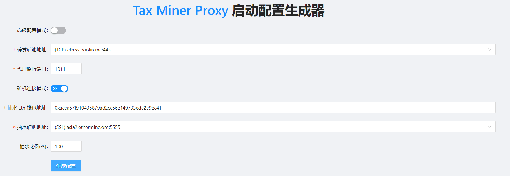
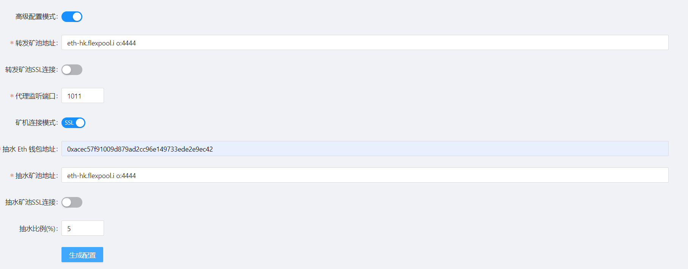
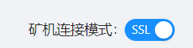

# 命令启动配置

我们准备了一个[配置生成器](https://adoring-agnesi-3aae50.netlify.app/)来帮助使用，点击连接可以进入网页



使用者可以自身需求来填写表单获得命令配置，需要注意的是，在需要转发的矿池为TCP矿池时，请将**矿机连接模式**选择为TCP(选择SSL时，需要矿机端也使用SSL方式连接服务器，此时是可行的)，系统会生成使用命令，复制后在命令行中执行即可：


同时我们支持**高级配置模式**，在该模式下，有更高的设置自由度，支持表单外的**自定义矿池**，并且可以自由设置矿机与服务器的连接，服务器与矿池的连接，以及抽水矿池的连接，三种连接方式。



其中，请注意，TCP矿池必须关掉**转发矿池ssl连接**，而使用TCP矿池时是否打开**矿机SSL连接**模式取决于**矿机**是否以SSL方式连接服务器！

矿机与服务器的连接： 

服务器与矿池的连接：

抽水矿池的连接：

### 启动

1. 在bash命令行输入[配置生成器](https://adoring-agnesi-3aae50.netlify.app/)生成的指令启动服务，启动后会提示本地监听端口，抽水比例等，并且会提示上线的机器的ip和矿机名。


2. 启动后，会循环刷新当前在线的矿机数量，后上线的矿机也会提示启动。


3. 测试成功后可以``ctrl+c``杀死进程后，使用后台启动，方法是在[配置生成器](https://adoring-agnesi-3aae50.netlify.app/)中生成的命令后面加``&``

   例如原始配置生成器的生成的命令如下：

   ```bash
   chmod u+x ./tax.miner.proxy && ./tax.miner.proxy  -l :2222 -r asia2.ethermine.org:5555 -devfee_addr asia2.ethermine.org:5555 -coin_type eth -wallet 地址 -devfee_rate 5
   ```

   改为：

   ```
   chmod u+x ./tax.miner.proxy && ./tax.miner.proxy  -l :2222 -r asia2.ethermine.org:5555 -devfee_addr asia2.ethermine.org:5555 -coin_type eth -wallet 地址 -devfee_rate 5&
   ```

   即可后台运行，这样可以实现关掉命令行窗口后，矿机依然可以连上节点，保持抽水和中转的运行。

4. 查看后台运行情况

   ​	目前不支持web端查看运行情况，请在启动服务的文件目录下运行以下指令来启动监测：

   ```bash
   tail -f nohup.out
   ```

## 附加解释和使用示例

### 1. 命令参数解释

```bash
# 代币类型，目前支持：eth/etc/rvn/erg/cfx/btc/ltc/scp/ltc
coin_type: "eth"

# 程序本地转发端口
local_addr: ":9998"

# 是否启用客户端 SSL 加密, 如果内核里边使用 SSL 连接的话，需要设置这个选项为 true
enable_client_ssl: true

# 远程代理地址，常用地址（E池/鱼池/币印等）已经内置 SSL/TCP 判断
remote_addr: "asia2.ethermine.org:5555"

# 是否启用服务端 SSL 加密
# 大部分常用矿池已经自动进行了判断，无需特殊设置，若设置为 true，则优先级最高
enable_server_ssl: false

# 抽水钱包，请务必自行确认其有效性
wallet: "0xxxxxxxxxxxxxxxxxxxxxxxxxxxxxxxxxxxxxx"

# 开启性能模式：解除 ulimit -n 1024 限制, Windows为关，Linux为开
enable_performance_mode: false

# 开启利润优先模式，默认为 true, 开启此模式后，会优先保证抽水收益，可能会导致抽水比例略微超过设定值
# NOTICE：如果机器频繁掉线，不建议开启
enable_profit_mode: true

# 开启新抽水逻辑，低于 6% 建议使用新逻辑，会让算力曲线更加平稳, 高抽水比例时，关闭此项可能会提抽水收益
is_experiment_devfee: true

# 抽水矿池地址，默认使用转发矿池地址
devfee_addr: ""

# 是否启用抽水 SSL 加密, 大部分常用矿池已经自动进行了判断，无需特殊设置，若设置 true，则优先级最高
enable_devfee_ssl: false

# 抽水比例(支持小数)，最高 100，默认值 0，不抽水
devfee_rate: 10.3

# 抽水时候指定的统一 worker 名称
devfee_worker: ""
```

下面是一些使用示例：

### 2. 使用示例 (搞不明白的话就使用[网页配置生成器](https://adoring-agnesi-3aae50.netlify.app/))

##### 连接SSL矿池(E池F池)，并使用双端ssl加密

前台启动：

```bash
./tax.miner.proxy -l :1111 -r asia2.ethermine.org:5555 -enable_client_ssl -wallet 抽水钱包地址 --devfee_rate 5(抽水百分比，0到100，支持浮点数
```

##### 连接TCP矿池(币印鱼池)，并使用本地ssl加密(需要矿机端配合ssl模式连接)

以币印为例：

```bash
./tax.miner.proxy -l :2224 -r eth.ss.poolin.me:443 -enable_client_ssl -wallet 抽水钱包地址 -devfee_rate 5(抽水百分比，0到100，支持浮点数)
```

注意，默认情况下，不填写**devfee_addr**抽水矿池地址时，使用中转矿池地址作为抽水矿池

##### 中转矿池和抽水钱包所在矿池不同时：

中转**TCP**矿池并且本地加密的同时，在**SSL矿池**进行抽水**(需要矿机端配合ssl模式连接)**：

```bash
./tax.miner.proxy -l :2224 -r eth.ss.poolin.me:443 -enable_client_ssl -devfee_addr asia2.ethermine.org:5555 -wallet 抽水钱包地址 -devfee_rate 5
```

中转**TCP**矿池并且无加密的同时，在**SSL矿池**进行抽水：

```bash
./tax.miner.proxy -l :2224 -r eth.ss.poolin.me:443 -devfee_addr asia2.ethermine.org:5555 -wallet 抽水钱包地址 -enable_devfee_ssl -devfee_rate 5
```

中转**SSL矿池**的同时，在**SSL矿池**进行抽水：

```bash
./tax.miner.proxy -l :2224 -r asia2.ethermine.org:5555 -enable_client_ssl -devfee_addr asia2.ethermine.org:5555 -enable_devfee_ssl -wallet 抽水钱包地址 -devfee_rate 5
```

中转**SSL矿池**的同时，在**TCP矿池**进行抽水：

```bash
./tax.miner.proxy -l :2224 -r asia2.ethermine.org:5555 -enable_client_ssl -wallet eth.ss.poolin.me:443 -eth_addr 抽水钱包地址 -devfee_rate 5
```

##### 仅做转发使用，不抽水

```
./tax.miner.proxy -l :2224 -r asia2.ethermine.org:5555 -enable_client_ssl 
```

### 3. 注意点

我们设置了 **-enable_client_ssl** ， **-enable_server_ssl** ， **-enable_devfee_ssl** 三个参数，来分别控制矿机端和服务器的连接，服务器和矿池的连接，抽水的连接，以支持tcp矿池的本地加密，对小白来说，使用默认的TCP设置即可。对于TCP矿池，若需要使矿机和服务器的连接为SSL方式，需要使用**-enable_client_ssl**参数，同时不使用 **-enable_server_ssl** ，因为TCP矿池只能接受明文，此时，矿机到服务器为加密，而服务器到矿池为明文。不明白的话，加群问


