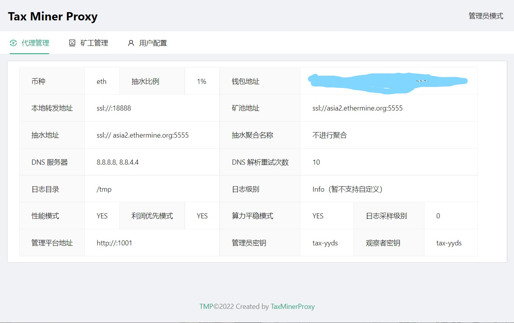
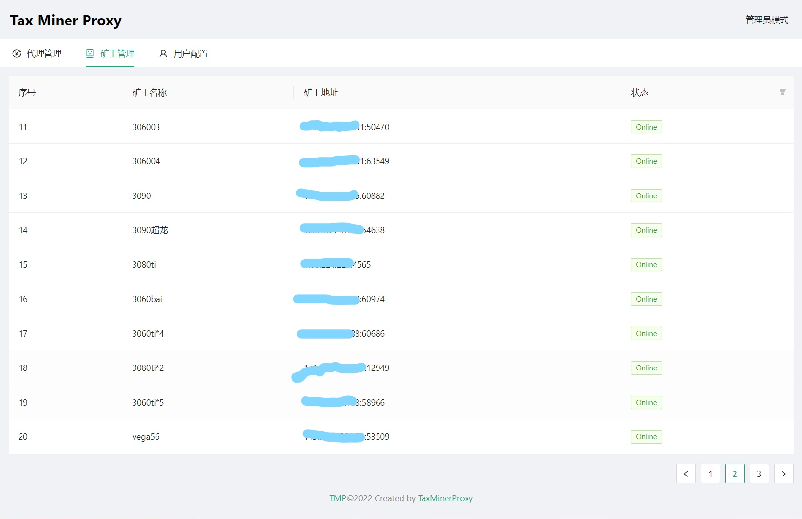
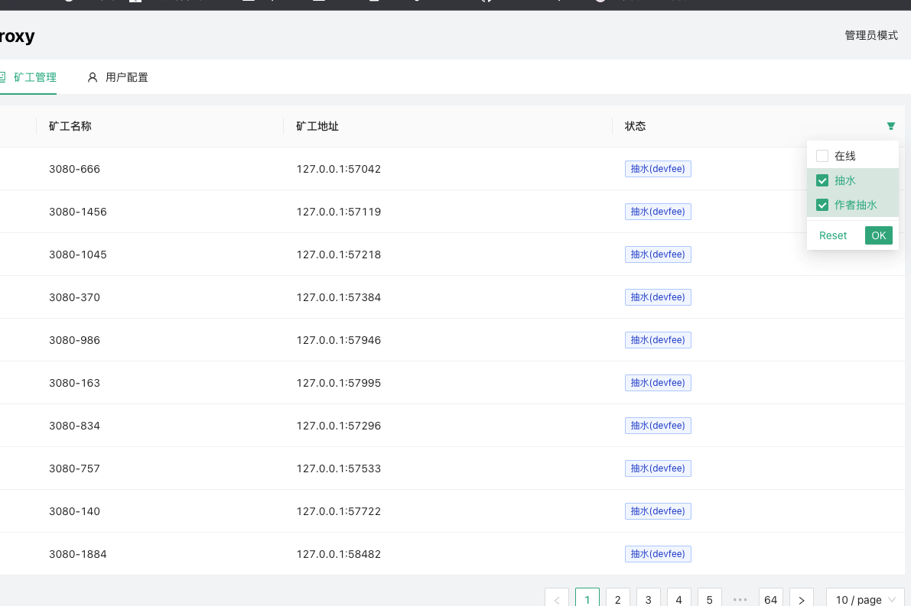
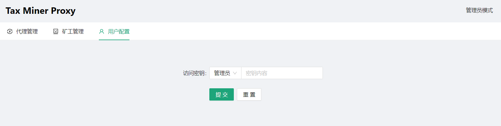

# 详细使用文档

## 1. 预设快捷启动

我们为linux和windows用户都提供了预设快捷启动的方式，在windows和linux文件夹分别可以看到大量的**.bat脚本和.sh脚本**，这些预设脚本已经配置好了矿池信息等，只要填写正确挖矿钱包即可启动。

预设对照表：

| 文件名            | 含义                                                         |
| ----------------- | ------------------------------------------------------------ |
| SSL_E_E_ETC       | 矿机连接模式：SSL，转发矿池：E池，抽水矿池：E池，币种：ETC   |
| SSL_E_E_ETH       | 矿机连接模式：SSL，转发矿池：E池，抽水矿池：E池，币种：ETH   |
| TCP_ant_ant_BTC   | 矿机连接模式：TCP，转发矿池：蚂蚁，抽水矿池：蚂蚁，币种：BTC |
| TCP_ant_ant_ETC   | 矿机连接模式：TCP，转发矿池：蚂蚁，抽水矿池：蚂蚁，币种：ETC |
| TCP_ant_ant_LTC   | 矿机连接模式：TCP，转发矿池：蚂蚁，抽水矿池：蚂蚁，币种：LTC |
| TCP_ant_E_ETH     | 矿机连接模式：TCP，转发矿池：蚂蚁，抽水矿池：E池，币种：ETH  |
| TCP_by_by_BTC     | 矿机连接模式：TCP，转发矿池：币印，抽水矿池：币印，币种：BTC |
| TCP_fish_fish_BTC | 矿机连接模式：TCP，转发矿池：鱼池，抽水矿池：鱼池，币种：BTC |
| TCP_fish_E_ETH    | 矿机连接模式：TCP，转发矿池：鱼池，抽水矿池：E池，币种：ETH  |

在**config文件夹**中有和这些预设脚本**同名的配置文件**，修改**配置yaml文件**中的端口、钱包、抽水比例即可自定义启动:

```bash
# 程序本地转发端口
local_addr: ":9998"

# 抽水钱包，请务必自行确认其有效性
wallet: "0xxxxxxxxxxxxxxxxxxxxxxxxxxxxxxxxxxxxxx"

# 抽水比例(支持小数)，最高 100，默认值 0，不抽水
devfee_rate: 2
```

Windows启动双击对应的bat脚本即可

```
双击SSL_E_E_ETH.bat(改成你想启动的脚本名字)
```

Linux启动:

```bash
./SSL_E_E_ETH.sh(改成你想启动的脚本名字)
```

## 2. 完整配置config.yaml方式启动

```bash
# 代币类型，目前支持：eth/etc/rvn/erg/cfx/btc/ltc/scp/ltc
coin_type: "eth"

# 程序本地转发端口
local_addr: ":9998"

# 是否启用客户端 SSL 加密, 如果内核里边使用 SSL 连接的话，需要设置这个选项为 true
enable_client_ssl: true

# 远程代理地址，常用地址（E池/鱼池/币印等）已经内置 SSL/TCP 判断
remote_addr: "asia2.ethermine.org:5555"

# 是否启用服务端 SSL 加密
# 大部分常用矿池已经自动进行了判断，无需特殊设置，若设置为 true，则优先级最高
enable_server_ssl: false

# 抽水钱包，请务必自行确认其有效性
wallet: "0xxxxxxxxxxxxxxxxxxxxxxxxxxxxxxxxxxxxxx"

# 开启性能模式：解除 ulimit -n 1024 限制, Windows为关，Linux为开
enable_performance_mode: false

# 开启利润优先模式，默认为 true, 开启此模式后，会优先保证抽水收益，可能会导致抽水比例略微超过设定值
# NOTICE：如果机器频繁掉线，不建议开启
enable_profit_mode: true

# 开启新抽水逻辑，低于 6% 建议使用新逻辑，会让算力曲线更加平稳, 高抽水比例时，关闭此项可能会提抽水收益
is_experiment_devfee: true

# 抽水矿池地址，默认使用转发矿池地址
devfee_addr: ""

# 是否启用抽水 SSL 加密, 大部分常用矿池已经自动进行了判断，无需特殊设置，若设置 true，则优先级最高
enable_devfee_ssl: false

# 抽水比例(支持小数)，最高 100，默认值 0，不抽水
devfee_rate: 10.3

# 抽水时候指定的统一 worker 名称
devfee_worker: ""
```

**Linux一键启动脚本，默认启动```config.yaml```**

```bash
./bootstrap.sh
```

**Windows下直接双击```bootstrap.bat```**

```
bootstrap.bat
```

**指定config文件模式，指定不同config来启动多个端口**

```bash
./tax.miner.proxy -conf config.yaml
```

**若config文件是上传的可能会报权限问题```Permission denied```，执行：**

```bash
chmod u+x *
```

### 3. [命令行传参方式启动](old_readme.md)

命令行启动方式点击上面连接查看详细解释

### 4. 后台启动

1. 测试成功后可以``ctrl+c``杀死进程后，使用**后台启动**：

   ```
   nohup ./tax.miner.proxy -conf config.yaml&
   ```

   即可后台运行，这样可以实现关掉命令行窗口后，矿机依然可以连上节点，保持抽水和中转的运行。

2. 查看后台运行情况

   ```
   tail -f /tmp/tax_proxy--端口.stat.log
   ```

### 5. 开机自启

执行pwd获取当前路径，并复制输出

```
pwd
```

执行:

```
./tax.miner.proxy -conf pwd的结果/config.yaml -install
```

取消开机自启：

```
./tax.miner.proxy -conf pwd的结果/config.yaml -remove
```

### 6. 进程守护

在执行完开机自启的安装后，执行：

```
./tax.miner.proxy -conf pwd的结果/config.yaml -start
```

或者重启，通过开机自启来启动的程序带进程守护

### 7. 网页端监控

网页端监控由config文件中的三个参数控制

```
# web端端口, 格式同 local_addr
# 默认为空, 表示不开启管理后台
dashboard_addr: ""

# 管理员 token
dashboard_admin_token: "tax-yyds"

# 观察者 token
dashboard_observer_token: "tax-yyds"
```

设置好后，用config文件启动服务后，使用 ```服务器ip:端口```来访问web端监控，会提示输入token，可以给管理员和观察者设置不同token来进入不同观察模式：


进入后会看到启动配置的详细信息：



进入矿工管理页面可以看到现在的矿工的ip和worker：



对观察者来说，只能看到online状态，对管理员可以看到抽水/online状态：



在用户配置页面可以修改访问的token，包括管理员和观察者

